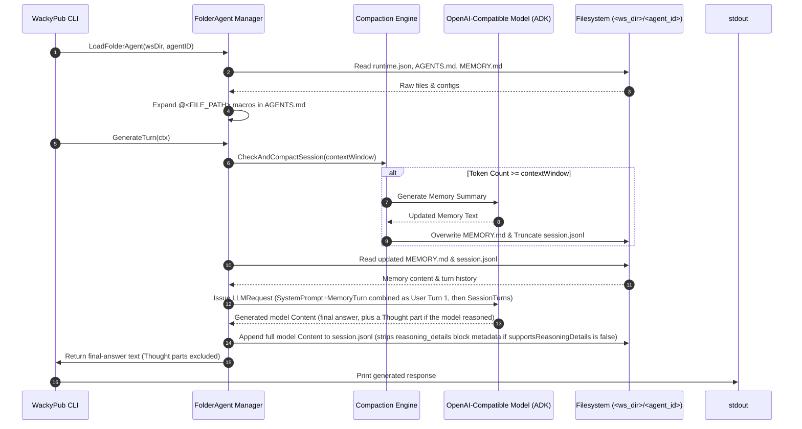

# 🏛️ WackyPub Architecture: Agent Session Management

This document details the architecture, directory specs, lifecycle, compaction mechanics, and Google Agent Development Kit (ADK) integration for agent sessions in **WackyPub**.

> This is the deep reference: full schemas, diagrams, and mechanics. For quick orientation when working in this repo, and for the *why* behind specific design choices, see [`.agents/AGENTS.md`](../.agents/AGENTS.md) and [`.agents/DECISIONS.md`](../.agents/DECISIONS.md).

---

## 📑 Table of Contents

1. [Overview](#1-overview)
2. [Workspace & Directory Structure](#2-workspace--directory-structure)
3. [File Specifications](#3-file-specifications)
   - [runtime.json](#runtimejson)
   - [AGENTS.md & Macro Expansion](#agentsmd--macro-expansion)
   - [MEMORY.md](#memorymd)
   - [session.jsonl](#sessionjsonl)
   - [WACKYPUB_ALLOWED_AGENTS](#wackypub_allowed_agents)
   - [tools/ Directory](#tools-directory)
   - [scratchpad/ Directory](#scratchpad-directory)
4. [Google ADK Integration Layer](#4-google-adk-integration-layer)
5. [Execution Lifecycle](#5-execution-lifecycle)
6. [Session Compaction Mechanics](#6-session-compaction-mechanics)
7. [Reasoning / Thinking Support](#7-reasoning--thinking-support)
8. [CLI Command Pipeline](#8-cli-command-pipeline)
9. [Session Locking](#9-session-locking)
10. [Programmatic Go SDK API](#10-programmatic-go-sdk-api-pkgagent)

---

## 1. Overview

WackyPub manages agents using a file-system-first architecture. Each agent operates within a dedicated directory located inside a workspace directory (`<ws_dir>`).

```
<ws_dir>/
├── WACKYPUB_ROOT          # Empty marker file designating workspace root
└── <agent_id>/
    ├── runtime.json       # LLM Endpoint, Model & Compaction Settings (or Symlink)
    ├── .env               # Optional Agent Environment Variables for tool execution (D32)
    ├── AGENTS.md          # System Prompt with @<FILE_PATH> Macro Inclusions
    ├── MEMORY.md          # Long-term Compacted Memories
    ├── session.jsonl      # Sequential Turn History Log (JSON Lines)
    ├── session.lock       # PID-based Exclusive Process Lock
    ├── WACKYPUB_ALLOWED_AGENTS # Opt-in allowlist of target agents for cross-agent calls
    ├── scratchpad/        # Persistent session scratchpad entries (1 file per entry, D30)
    ├── tools/             # Discovered executable tool binaries / scripts
    └── skills/            # Discovered skill folders containing SKILL.md
```

By decoupling runtime configuration, system prompts, memory, turn logs, tools, and cross-agent authorization into discrete files, agent state is human-readable, source-controllable, and easily inspectable.

---

## 2. Workspace & Directory Structure

- **Workspace Root Marker (`WACKYPUB_ROOT`)**: Every valid workspace directory must contain an empty `WACKYPUB_ROOT` marker file directly at its root.
- **Workspace Discovery**:
  - **Unspecified `--ws`**: Walks up directory ancestors from the current working directory (`CWD`) to find the nearest directory containing `WACKYPUB_ROOT`. Errors if no marker file is found.
  - **Explicit `--ws <path>`**: Validates that `<path>` directly contains `WACKYPUB_ROOT`.
- **Agent Directory (`<ws_dir>/<agent_id>/`)**: Contains all runtime configuration, prompt templates, memory, session history, allowlists, scratchpads, and tools for `<agent_id>`.

---

## 3. File Specifications

### `runtime.json`

Specifies the LLM provider configuration and session compaction parameters for the agent.

> 💡 **Symlink Support**: `runtime.json` may be a symbolic link to a shared global configuration file (e.g. `../shared_runtime.json`). The runtime loader evaluates symlinks automatically via `filepath.EvalSymlinks`.

#### Schema
```json
{
  "endpoint": "https://api.openai.com/v1",
  "model": "gpt-4o",
  "apiKey": "sk-...",
  "sessionCompactPct": 50.0,
  "contextWindow": 128000,

  "preserveThinking": false,
  "reasoningEgress": "",
  "reasoningField": "",
  "supportsReasoningDetails": false,
  "extraBody": {}
}
```

#### Fields
| Field | Type | Description |
|---|---|---|
| `provider` | `string` | Model provider selection: `"openai"` (default when `endpoint` is set), `"gemini"` (default when `endpoint` is empty), or `"anthropic"`. |
| `endpoint` | `string` | Base HTTP URL endpoint (e.g. `https://api.openai.com/v1`, `https://api.anthropic.com`, `http://localhost:11434/v1`). |
| `model` | `string` | Target LLM model identifier (e.g., `gpt-4o`, `claude-3-7-sonnet-20250219`, `gemini-2.5-flash`). |
| `apiKey` | `string` | Bearer token / API key for authentication. |
| `anthropicThinkingBudgetTokens` | `int` | Anthropic classic thinking token budget (e.g. `1024`). Must be >= 1024 and less than output token limits. |
| `anthropicThinkingEffort` | `string` | Anthropic reasoning effort (`"low"`, `"medium"`, `"high"`, `"max"`) for adaptive thinking mode. |
| `anthropicThinkingMode` | `string` | Anthropic thinking mode: `"enabled"` (classic budget), `"adaptive"` (effort-based), or empty for auto-detection. |
| `geminiThinkingBudget` | `int` | Gemini token budget for reasoning (e.g. `2048`). |
| `geminiThinkingLevel` | `string` | Gemini reasoning level (`"low"`, `"medium"`, `"high"`, `"minimal"`). |
| `geminiIncludeThoughts` | `bool` | Whether thoughts are included in output parts for native Gemini models (default: `true`). |
| `reasoningEffort` | `string` | OpenAI / OpenRouter reasoning effort (`"low"`, `"medium"`, `"high"`). |
| `contextWindow` | `int` | Optional maximum token threshold triggering auto-compaction. `0` disables auto-compaction. |
| `timeoutSeconds` | `int` | HTTP client timeout in seconds for API calls to the LLM backend (default: `900` seconds / 15 minutes). |
| `preserveThinking` | `bool` | Set for backends that resend and bill for prior reasoning text on every turn (e.g. Kimi K2 Thinking, DeepSeek V4 thinking mode). When true, the compaction token estimate counts `Thought`-marked part text, since it's actually replayed to the model on every subsequent request. Leave `false` for backends that drop/ignore replayed reasoning by default (e.g. Qwen3). See [§7](#7-reasoning--thinking-support). |
| `reasoningEgress` | `string` | Wire shape used to send reasoning back as history: `""`/`"native"` (own field, required by DeepSeek V4 thinking mode & Kimi K2 Thinking), `"think_tags"` (folded into `content` as a `<think>` block, for backends that 400 on an unknown field), or `"omit"` (send no reasoning at all). |
| `reasoningField` | `string` | Name of the provider's plain-text reasoning field, read on ingest and written on egress. Empty means `"reasoning_content"`. OpenRouter uses `"reasoning"` instead. |
| `supportsReasoningDetails` | `bool` | Allows OpenRouter's structured `reasoning_details` block array (including encrypted/signed reasoning) to be replayed as history. Only safe with a **pinned** `model` — see [§7](#7-reasoning--thinking-support) for why `"auto"` routing breaks this. |
| `extraBody` | `map[string]any` | Provider-specific fields merged into the root of every request body, for extensions Chat Completions doesn't define — e.g. `{"reasoning": {"effort": "high"}}` to request extended thinking from OpenRouter-routed models that don't emit it by default. |
| `extraHeaders` | `map[string]string` | Overrides the default identifying HTTP headers sent on every request (`X-Title: WackyPub`, `HTTP-Referer: https://github.com/colinrgodsey/wackypub`, plus `X-OpenRouter-Title`/`X-OpenRouter-Categories` when the endpoint is detected as OpenRouter — together what stops a client from showing up as "unknown" on OpenRouter's dashboard/rankings). A key present here replaces the default of the same name; useful for anyone embedding wackypub under their own product name. `User-Agent` is not overridable this way — see DECISIONS.md D43. |

---

### `AGENTS.md` & Macro Expansion

`AGENTS.md` defines the base system prompt instructions for the agent.

#### `@<FILE_PATH>` Macro Expansion
To promote modular prompts, `AGENTS.md` supports embedding secondary files using the `@<FILE_PATH>` macro syntax:

```markdown
# Role: Archmage Ignis
You are Ignis, an ancient wizard.

@rules/spells.md
@prompts/personality.txt
```

#### Macro Resolution Rules:
1. **Boundary Matching**: An `@` include directive must be preceded by a boundary delimiter — start of line (`^`), whitespace, or enclosing punctuation (`(`, `[`, `{`, `<`, `"`, `'`, or `` ` ``) — and must end with an alphanumeric character or path separator (`[a-zA-Z0-9_\-/]`). Text without leading boundaries (such as email addresses like `user@agentmail.to` or `crgodsey@gmail.com`) is never matched or mangled. Trailing sentence punctuation (such as `.` or `,`) and closing brackets/parentheses are preserved.
2. **Workspace Containment**: File paths after `@` are resolved relative to the agent's directory (`<ws_dir>/<agent_id>/`) and must remain contained within the workspace root (`wsDir`, identified by `WACKYPUB_ROOT` or defaulting to `filepath.Dir(agentDir)`). Path traversal attempts escaping the workspace root (e.g. `@../../../etc/passwd`) are rejected and left literal without reading. Cross-agent or shared includes staying within the workspace root (e.g. `@../shared/rules.md`) are permitted. Symlinks are evaluated and verified to remain within the workspace root.
3. **Existence Gating (D90 Parity)**: Inclusion only fires if the resolved file actually exists and is not a directory. Missing files, directories, and social mentions (e.g. `@DranboF`, `@here`) pass through verbatim as literal text without generating error comments.
4. **Escaping**: Prefixing with a backslash or double-at (`\@path` or `@@path`) bypasses expansion immediately and emits `@path` literally, stripping the escape marker.
5. **Stack-Scoped Cycles & Recursion**: Macro expansion works recursively (files included via `@` can themselves contain `@` macros). Inclusions are tracked on an active call stack: repeated non-circular inclusions (e.g. `@rules.md ... @rules.md` or diamond includes) expand cleanly, while true circular import cycles (e.g., File A imports File B which imports File A) are detected while on the stack and omitted safely with `<!-- Circular macro import omitted: <path> -->`.
6. **Depth Limit**: Maximum expansion recursion depth is capped at 10 to prevent runaway recursion or stack overflow, bubbling an error up to the caller if exceeded.

---

### `MEMORY.md`

`MEMORY.md` contains long-term, compacted memory facts and relationship state for the agent.

#### Key Mechanics:
- If `MEMORY.md` does not exist in `<agent_id>/`, it is treated as empty (`""`).
- **Hardcoded Context Position (User Turn 1)**: There is no separate "system" role message. Instead, the fully rendered `AGENTS.md` system prompt and the current contents of `MEMORY.md` are combined into a **single first user turn**, sent as plain user-role text (not a `system`/`developer` role message) for broad compatibility across OpenAI-compatible backends — some local model chat templates don't handle a `system` turn correctly, so folding it into the first user message is the one behavior that works everywhere:
  ```
  <rendered AGENTS.md system prompt>

  <PERSISTENT_MEMORY>
  <contents of MEMORY.md>
  </PERSISTENT_MEMORY>
  ```
- **Prefix Consistency**: Both normal generation (`GenerateTurn`) and compaction (`CheckAndCompactSession`) build this exact same first-turn text, so the conversation prefix stays identical between the two, maximizing LLM prompt cache performance.

---

### `session.jsonl`

`session.jsonl` stores the conversation turn history log in JSON Lines format (one JSON object per line). Each line is a serialized [`genai.Content`](https://pkg.go.dev/google.golang.org/genai#Content) — not a custom struct — so it natively supports multi-part messages, including reasoning/thinking, images, and other multimedia, with no lossy round-trip through a text-only format.

#### Schema per line
```json
{"role": "user", "parts": [{"text": "Hello, traveler!"}]}
{"role": "model", "parts": [{"text": "Let me think about how to greet them...", "thought": true}, {"text": "Greetings! What brings you to my tavern?"}]}
```

#### Rules:
- Roles are `"user"` and `"model"` (the ADK/`genai` convention), not `"user"`/`"assistant"`.
- There is no `timestamp` field — `genai.Content` doesn't have one, and none is added.
- The system prompt is **never stored** inside `session.jsonl` — it's re-rendered from `AGENTS.md` and injected fresh into the first turn on every generation (see [MEMORY.md](#memorymd) above).
- A `Part` with `"thought": true` holds reasoning/chain-of-thought text captured from the model, kept separate from the final-answer part(s). See [§7](#7-reasoning--thinking-support).
- A part can also carry a `partMetadata` object holding an opaque, provider-specific block (e.g. OpenRouter's `reasoning_details`, including encrypted/signed reasoning) — see [§7](#7-reasoning--thinking-support).

---

### `WACKYPUB_ALLOWED_AGENTS`

`WACKYPUB_ALLOWED_AGENTS` is an opt-in plain-text allowlist file in an agent's directory (`<agent_id>/WACKYPUB_ALLOWED_AGENTS`) listing target agent IDs that the current agent is authorized to invoke via cross-agent calls (e.g. messaging tools).

#### Key Rules:
- Each non-empty line (ignoring `#` comments) specifies one allowed target agent ID.
- **Default Deny-All**: If `WACKYPUB_ALLOWED_AGENTS` is absent from an agent's directory, all cross-agent target invocations and private content reads (`read-session`, `read-memory`, `render-prompt`, scratchpads) from that agent directory are denied (D16, D60). Diagnostic inspection (`wackypub workspace` / `InspectAgent`) remains exempt as it only exposes structural metadata.
- **Deadlock Safety & A2A Metadata (`AGENT2AGENT` / `WACKYPUB_CALL_CHAIN`)**: Cross-agent calls propagate Agent2Agent (A2A) protocol context via the `AGENT2AGENT` environment variable (carrying `caller_id`, `call_chain`, `trace_id`, and `metadata` as dense JSON - D33), falling back to `WACKYPUB_CALL_CHAIN` CSV strings for legacy callers. Re-targeting an agent already in `call_chain` is rejected immediately on mutating operations to prevent deadlock cycles (D16, D59, D60).

---

### `tools/` Directory

`<agent_id>/tools/` contains executable binaries or scripts discovered and registered as tools during generation turns (see DECISIONS.md D14, D17).

#### Discovery & Invocation:
- Recursively walked for executable files (`mode & 0111 != 0`).
- Discovered executables under `tools/` are dispatched through a single generic `run_command` tool (`genai.FunctionDeclaration`), rather than N individual declarations.
- `run_command`'s description is constructed dynamically at agent-load time, embedding an alphabetically sorted list of available commands and general execution guidance (working directory, argv conventions, scratchpad usage, and `--help` exploration).
- `run_command` accepts:
  - `command`: Name of the command executable to run from `tools/`.
  - `args`: Array of positional CLI command arguments (supports inline `<SCRATCHPAD_DATA id="X" />` macro expansion).
  - `env`: Key-value map of environment variables (not macro-expanded).
  - `stdin`: Optional stdin template string (supports inline `<SCRATCHPAD_DATA id="X" />` macro expansion).
- Executed in a multi-turn tool loop within `GenerateTurn` up to `--max-tool-turns` (default `10`).

---

### `scratchpad/` Directory

`scratchpad/` is a persistent directory (`<agent_id>/scratchpad/`) storing one raw text file per live entry (`<id>-<created_by>.txt`) with collision-safe 4-character IDs and mtime-based eviction at a capacity of 300 entries (see DECISIONS.md D18, D30).

#### Built-in Tools & I/O Integration:
- **`create_scratchpad(text: string)`**: Stores `text` under a freshly generated 4-character ID (`[0-9a-z]`), returning `{id, size}`. Automatically evicts the entry with the oldest file mtime when live entries exceed cap (300). Atomic and collision-safe across separate OS processes via `O_CREATE|O_EXCL`.
- **`get_scratchpad(id: string, skip_lines?: int, num_lines?: int)`**: Retrieves stored text by ID, optionally paginated by line range.
- **`list_scratchpads()`**: Lists metadata for all currently-live scratchpad entries (id, size, lines, created_by) ordered by file mtime ascending, and reports current capacity usage (D39).
- **`search_scratchpad(id: string, query: string, case_sensitive?: bool, regex?: bool, max_results?: int)`**: Searches a specific scratchpad entry by ID for matching lines (see DECISIONS.md D25). Returns 1-indexed line numbers, precomputed `skip_lines` for `get_scratchpad` pagination, and truncated line text (~200 chars), with total match counts reported separately.
- **Inline Macro Expansion**: Positional arguments and `stdin` template string in `run_command` expand `<SCRATCHPAD_DATA id="X" skip_lines="N" num_lines="M" json_escape="true" />` server-side before process execution. When `json_escape="true"` is set, content is substituted as JSON-escaped text (quotes, newlines, and backslashes escaped per RFC 8259) without adding surrounding quotes (D37). Arguments exceeding 500,000 bytes after expansion fail fast.
- **Automatic Output Redirection**: Subprocess stdout/stderr exceeding 4,000 bytes are automatically captured into fresh scratchpad entries, returning structured tags like `<STDOUT><SCRATCHPAD_DATA id="k3p1" size="5001" lines="42" /></STDOUT>` (D39).

---

### `skills/` Directory

`<agent_id>/skills/` contains pre-written, distilled skill guidance folders holding `SKILL.md` files with YAML frontmatter (see DECISIONS.md D20).

#### Discovery & Loading Modes:
- Recursively walked for folders containing `SKILL.md`.
- `SKILL.md` frontmatter fields:
  - `name`: Unique skill identifier (defaults to folder name).
  - `description`: Short description of the skill.
  - `always_load`: Optional boolean (`true` or `false`).
- **On-demand Skills** (`always_load: false`): Registered with the `load_skill(name: string)` tool. Available skill names and descriptions are embedded in `load_skill`'s dynamically built description (alphabetically sorted). Invoking `load_skill` returns the skill body as a `FunctionResponse` turn.
- **Always-loaded Skills** (`always_load: true`): Excluded from `load_skill`. Concatenated onto the rendered system prompt (`Instruction`), sorted alphabetically by skill name, wrapped in `<AUTOLOADED_SKILLS><SKILL name="...">...</SKILL>...</AUTOLOADED_SKILLS>`.

---

## 4. Google ADK Integration Layer

WackyPub integrates with **Google Agent Development Kit v2** (`google.golang.org/adk/v2`) for core types (`model.LLM`, `model.LLMRequest`/`LLMResponse`, `agent.Agent`, `session.Event`, `tool.Tool`), and executes generation turns directly via ADK's `runner.Runner` powered by a custom file-backed `session.Service` (`FileSessionService` in `pkg/agent/file_session_service.go`).

```
┌─────────────────────────────────────────────────────────────┐
│                      WackyPub CLI                         │
└──────────────────────────────┬──────────────────────────────┘
                               │
                               ▼
┌─────────────────────────────────────────────────────────────┐
│         FolderAgent.GenerateTurn (pkg/agent/agent_folder.go) │
│    runs ADK runner.Runner with custom FileSessionService    │
└──────────────────────────────┬──────────────────────────────┘
                               │
                               ▼
┌─────────────────────────────────────────────────────────────┐
│              OpenAI-Compatible ADK Model Adapter             │
│   pkg/agent/openai_model.go -> adk-utils-go's genai/openai   │
│      (official github.com/openai/openai-go/v3 SDK underneath) │
└──────────────────────────────┬──────────────────────────────┘
                               │ HTTP POST /chat/completions
                               ▼
┌─────────────────────────────────────────────────────────────┐
│               OpenAI-Compatible LLM Provider                │
│  (OpenAI, OpenRouter, DeepSeek, Kimi, vLLM, Ollama, llama.cpp) │
└─────────────────────────────────────────────────────────────┘
```

Agent generation turns are executed using ADK's `runner.Runner` pipeline with `FileSessionService` handling reading and appending session history directly to `<agent_id>/session.jsonl`.

### OpenAI Adapter: Upstream `github.com/achetronic/adk-utils-go`

`pkg/agent/openai_model.go`'s `NewOpenAIModel` is a thin wrapper around [`achetronic/adk-utils-go`](https://github.com/achetronic/adk-utils-go)'s `genai/openai` package, which itself wraps the official `openai-go/v3` SDK. `go.mod` tracks upstream `achetronic/adk-utils-go` at commit `1f0a646bcdfd07ad5f09363d6cbca3b5c58bd764` (which incorporated the `Dialect` interface for OpenRouter and reasoning handling), eliminating the need for a fork replace directive.

### ADK `llmagent.Config` Mapping (alternate `RunWithRunner` path)

1. **`Name`**: Set directly to `agentID` (which is already unique within the workspace directory).
2. **`Instruction`**: Set to the fully rendered system prompt string loaded from `AGENTS.md` (after processing `@<FILE_PATH>` macro inclusions).
3. **`Model`**: The configured `model.LLM` instance (OpenAI-compatible adapter or native Gemini).

```go
ag, err := llmagent.New(llmagent.Config{
    Name:        agentID,
    Description: fmt.Sprintf("Agent %s", agentID),
    Instruction: renderedPrompt, // Fully expanded AGENTS.md
    Model:       llmModel,
})
```

---

## 5. Execution Lifecycle

When running `wackypub agent <agent_id> generate`:



---

## 6. Session Compaction Mechanics

Compaction prevents conversation history from exceeding LLM context boundaries while preserving prefix caching.

### Normal Session Context Layout
1. **User Turn 1**: Fully rendered `AGENTS.md` system prompt, followed by `<PERSISTENT_MEMORY>\n<contents of MEMORY.md>\n</PERSISTENT_MEMORY>` — combined into one plain user-role turn (no `system`-role message is sent at all; see [MEMORY.md](#memorymd)).
2. **Session Turns**: All turns from `session.jsonl` (`user` / `model`).

### Compaction Session Context Layout
Compaction is triggered when session token count reaches `(100 - compact-overhead-pct)%` of `contextWindow` (default 20% overhead margin, configurable in `COMPACT.md`):
- **Pre-turn**: Evaluates `EstimateTokens` over `session.jsonl` turns before generation begins.
- **Mid-turn**: Evaluates real provider `PromptTokenCount` before subsequent tool turns (`modelCalls > 1`) and short-circuits early if the threshold is exceeded.
- **Post-turn**: Evaluates the turn's final `PromptTokenCount` and triggers compaction immediately before returning.

When compaction runs:
1. **User Turn 1**: Same combined system-prompt + `<PERSISTENT_MEMORY>` text as normal generation *(identical prefix, for prompt caching)*.
2. **Archived Turns**: Oldest turns from `session.jsonl` (determined by `compact-pct`, default 50% token-weighted), extended forward until the boundary lands right after a `model` turn — so the surviving session (`remainingTurns`) always starts fresh on a `user` turn.
3. **Compaction Directive (User Turn)**: Instructs the model to generate a concise, chronological markdown ADDENDUM capturing new developments from the archived turns (without repeating what `<PERSISTENT_MEMORY>` already has).

### Memory Update & Session Pruning:
1. The LLM generates a bulleted markdown **ADDENDUM** (extracted via `ContentText`, which excludes `Thought`-marked parts — reasoning never leaks into `MEMORY.md`).
2. The addendum is appended to `<agent_id>/MEMORY.md` (or replaces it if `append-only: false`).
3. The archived turns (`compactTurns`) are removed from `session.jsonl`, keeping only `remainingTurns`.

### Token Counting & Usage Tracking
WackyPub tracks real provider usage stats (`PromptTokenCount`) across generation turns and uses `EstimateTokens` (~4 chars/token heuristic, with `preserveThinking` awareness) when estimating offline turn history.

---

## 7. Reasoning / Thinking Support

Backends vary widely in how they expose and expect back a model's reasoning/chain-of-thought, and getting this wrong ranges from "wastes tokens" to "hard 400 error." This is handled by the OpenAI adapter (`pkg/agent/openai_model.go`, backed by the `colinrgodsey/adk-utils-go` fork — see [§4](#4-google-adk-integration-layer)) plus a few `runtime.json` knobs.

### Ingest

Reasoning is captured **unconditionally** on ingest, regardless of `runtime.json` settings — a plain-text reasoning field (`reasoningField`, default `"reasoning_content"`) becomes a `Thought`-marked `genai.Part`, and OpenRouter's structured `reasoning_details` blocks (including opaque encrypted/signed reasoning) are captured verbatim into `partMetadata` under the adapter's `ReasoningDetailMetadataKey`. This is why reasoning shows up in `session.jsonl` even for agents where egress is disabled — capture and replay are independently controlled.

### Egress

Controlled by `reasoningEgress` and `supportsReasoningDetails`:
- **`native`** (default): reasoning is sent back as its own field (named by `reasoningField`) on the assistant message, separate from `content`. Required by DeepSeek V4 thinking mode and Kimi K2 Thinking, which 400 if it's missing.
- **`think_tags`**: reasoning is folded into `content`, wrapped in a `<think>...</think>` block, for backends that reject an unrecognized field with a 400 (observed on Mistral, TensorRT-LLM, some gateways).
- **`omit`**: no reasoning is sent at all.
- **`supportsReasoningDetails: true`**: additionally replays OpenRouter's structured `reasoning_details` block array verbatim (unmodified, unreordered — the sequence has to match what the model produced). **Only safe with a pinned `model`** — encrypted/signed reasoning blocks are tied to the exact backend endpoint that produced them, and OpenRouter's `"auto"` router can pick a different endpoint on the next turn, which gets rejected with a 404 ("Encrypted payloads can only be replayed to the endpoint that created them"). If `supportsReasoningDetails` is `false`, `StripSignatures` removes any captured block metadata before a turn is persisted to `session.jsonl`, so a block captured while the setting was on doesn't sit around as dead weight (or a future stale-endpoint landmine) after it's turned off.

### Forcing extended thinking

Some models (e.g. Claude via OpenRouter) don't emit reasoning by default — it has to be explicitly requested via `extraBody`:
```json
"extraBody": {
  "reasoning": { "effort": "high" }
}
```

### Display vs. storage

`ContentText` (used for the CLI's printed/returned response, and for `MEMORY.md` addenda) always excludes `Thought`-marked parts — reasoning is preserved in `session.jsonl` for full fidelity, but never shown as if it were the character's actual dialogue.

### Manually stripping stale reasoning/thought signatures

If an agent's `session.jsonl` already contains `reasoning_details` block metadata from a prior backend (e.g. it was run against `"model": "auto"` on OpenRouter and picked up an encrypted block), or a Gemini `ThoughtSignature` from before the agent was switched to a different provider, that stale signature is a landmine — see [`wackypub agent <agent_id> strip-signatures`](#8-cli-command-pipeline) below. It removes only the signature/block metadata; readable `Thought` text is left in place.

---

## 8. CLI Command Pipeline

### Global Flags
- `--ws <path>`: Specifies workspace directory. Unspecified walks up from CWD looking for `WACKYPUB_ROOT`.
- `--max-tool-turns <int>`: Sets maximum consecutive tool-call turn limit per generation (default `300`).
- `--command-timeout-seconds <int>`: Sets maximum execution timeout in seconds for tool commands (`-1` to disable, default `900`). Precedence: CLI flag > `WACKYPUB_COMMAND_TIMEOUT_SECONDS` env var > default (`900`). Spawns each tool in an isolated process group (`Setpgid: true`) and terminates the entire process group upon timeout.

### Add User Turn (`add`)
```bash
wackypub agent <agent_id> add [message]
```
- Accepts message via positional argument, `-m / --message` flag, or piped stdin.
- Appends `{"role": "user", "parts": [{"text": message}]}` to `<ws_dir>/<agent_id>/session.jsonl`.

### Generate Assistant Turn (`generate`)
```bash
wackypub agent <agent_id> generate
```
- Loads agent from `<ws_dir>/<agent_id>`.
- Evaluates compaction triggers.
- Discovers executable tools in `<ws_dir>/<agent_id>/tools/` and registers them alongside built-in `set_scratchpad`/`get_scratchpad` tools.
- Executes multi-turn tool calling loop up to `--max-tool-turns` (default 300).
- Builds request contents and passes them through `CleanSessionTurns` (stripping dangling tool responses and merging consecutive user turns).
- Generates turn by calling the configured `model.LLM` directly.
- Prints final-answer text to `stdout` (`Thought` parts excluded).
- Appends generated turns (`genai.Content`) to `<ws_dir>/<agent_id>/session.jsonl`.

### Atomic Prompt Turn (`prompt`)
```bash
wackypub agent <agent_id> prompt [message]
```
- **Atomically** appends the user message and executes the generation turn loop under a **single session lock**.
- Prevents race conditions when multiple processes target the same agent.
- Accepts message via positional argument, `-m / --message` flag, or piped stdin.
- Prints generated assistant text to `stdout`.
- **Recommended over separate `add` + `generate`** for most use cases.

### Strip Provider Signatures (`strip-signatures`)
```bash
wackypub agent <agent_id> strip-signatures
```
- Permanently removes provider-specific opaque reasoning/thought signatures — OpenRouter `reasoning_details` block metadata and Gemini's `ThoughtSignature` field — from every turn in `<ws_dir>/<agent_id>/session.jsonl`, rewriting the file in place under the session lock.
- Readable plain-text `Thought` reasoning is left untouched.
- Run this before switching an agent's `runtime.json` to a different provider — a signature issued by the old provider is rejected outright if replayed to the new one (confirmed live: Anthropic 400s with `Invalid \`signature\` in \`thinking\` block` on a Gemini `ThoughtSignature`).

### Read Session (`read-session`)
```bash
wackypub agent <agent_id> read-session
```
- Prints every turn in `<ws_dir>/<agent_id>/session.jsonl` to stdout, one JSON-encoded `genai.Content` per line.
- Read-only.

### Read Memory (`read-memory`)
```bash
wackypub agent <agent_id> read-memory
```
- Prints current contents of `<ws_dir>/<agent_id>/MEMORY.md` to stdout.
- Read-only.

### Render System Prompt (`render-prompt`)
```bash
wackypub agent <agent_id> render-prompt
```
- Prints fully rendered system prompt (`AGENTS.md` after `@<FILE_PATH>` macro expansion).
- Read-only.

### Compact (`compact`)
```bash
wackypub agent <agent_id> compact
```
- Unconditionally performs session compaction on the agent's session history (summarizes oldest turns into MEMORY.md and prunes session.jsonl).

### Scratchpad Management (`scratchpad`)
```bash
wackypub agent <agent_id> scratchpad create [message]
wackypub agent <agent_id> scratchpad read <entry_id> [--skip-lines N] [--num-lines M]
wackypub agent <agent_id> scratchpad list
wackypub agent <agent_id> scratchpad search <entry_id> <query> [--regex] [--case-insensitive] [--max-results N]
```
- CLI-level access to an agent's persistent scratchpad (`<ws_dir>/<agent_id>/scratchpad/`) (see DECISIONS.md D27).
- `create`: accepts text via positional argument, `--message` flag, or piped stdin. Acquires session lock for atomic write.
- `read`, `list`, `search`: pure reads against atomic temp-file replacement, executing without session lock.
- Supports both `wackypub agent <agent_id> scratchpad <subverb>` and `wackypub agent scratchpad <subverb> <agent_id>` syntaxes for positional arguments - but flags (`--skip-lines`, `--regex`, etc.) only work in the second form (`wackypub agent scratchpad <subverb> <agent_id> ... --flag`); see `skills/wackypub-a2a/SKILL.md`'s Flag Ordering Caveat.

### Workspace Diagnostics & Git Versioning (`workspace`)
```bash
wackypub workspace
wackypub workspace <agent_id>
wackypub workspace init-git [agent_id]
wackypub workspace snapshot
wackypub workspace tag <name>
wackypub workspace push <remote>
```
- **Overview (`wackypub workspace`)**: Top-level diagnostic command inspecting workspace agents, git tracking status, presence of expected files (`WACKYPUB_ROOT`, `AGENTS.md`, `runtime.json`, `session.jsonl`, `MEMORY.md`, `WACKYPUB_ALLOWED_AGENTS`, `tools/`), discovered tools, shadowed tools, and issue warnings. Read-only: never creates or modifies any file.
- **Git Versioning Init (`wackypub workspace init-git [agent_id]`)**: Initializes a pure-Go git repository in an agent directory (`<ws_dir>/<agent_id>/.git`) or workspace root (`<ws_dir>/.git`) via `go-git`. When `.git` is present, every state event creates an isolated commit with embedded `AGENT2AGENT` JSON metadata and `workspace_revision` (D35).
- **Workspace Snapshot (`wackypub workspace snapshot`)**: Scans all workspace agent repositories, records each agent's active HEAD commit SHA in `<ws_dir>/MANIFEST.md`, and commits `MANIFEST.md` in the workspace root repository.
- **Workspace Tagging (`wackypub workspace tag <name>`)**: Tags the workspace root repository with `<name>` and tags each per-agent repository with `tag-<agent_id>`.
- **Remote Push (`wackypub workspace push <remote>`)**: Pushes each agent repository to `<remote>` under a remote branch matching its `agent_id`, and pushes all workspace and agent tags. Requires `--i-understand` flag confirmation to guard against accidental API key exfiltration.

### Causal Swarm Tracing (`trace`)
```bash
wackypub trace <agent_id> <commit> [-n <steps>] [-v <0..4>]
wackypub trace <trace_id> [-n <steps>] [-v <0..4>]
```
- **Targeted Trace**: Step-by-step backward causal traversal starting from `<commit>` in `<agent_id>`'s repository. Traverses backward through turn commits and follows `metadata.workspace_revision` out to calling agent repositories across inter-agent boundaries (D36).
- **Global Correlation Trace**: Searches across all workspace agent repositories for commits matching `<trace_id>` and reconstructs the causal execution chain.
- **Verbosity Levels (`-v 0..4`)**:
  - `0`: Minimal (event types, function call names, user prompt text)
  - `1`: Compact Default (event type, tool names, user text, assistant text)
  - `2`: Clean Full (complete text, stripped of thinking blocks & signatures)
  - `3`: Full with Thinking (includes thinking blocks, stripped of provider signatures)
  - `4`: Raw JSONL (dumps raw commit messages & `AGENT2AGENT` payloads as-is)

---

## 9. Session Locking

All SDK operations acquire an exclusive POSIX file lock (`flock`) on `<agent_id>/session.lock` before reading or writing session state.

### Mechanics
- **Lock file**: `<ws_dir>/<agent_id>/session.lock`
- **Lock type**: `syscall.Flock(fd, LOCK_EX)` — blocking exclusive lock.
- **PID visibility**: The current process PID is written to the lock file for diagnostic inspection.
- **Scope**: The lock is held for the duration of the SDK method call and released automatically via `defer`.

---

## 10. Programmatic Go SDK API (`pkg/agent`)

All agent functionality is exposed as a Go SDK (`agent.AgentSDK`) in `pkg/agent` for programmatic orchestration.

### Initializing the SDK
```go
import "github.com/colinrgodsey/wackypub/pkg/agent"

// Initialize SDK for workspace directory
sdk := agent.NewSDK("./my_workspace")
sdk.MaxToolTurns = 300 // Optional cap over consecutive tool turns
sdk.CommandTimeoutSeconds = 900 // Optional tool command execution timeout in seconds (-1 to disable)
```

### SDK Methods
```go
// Add a user message turn to session.jsonl (acquires session lock, returns *UserTurnResult with any hook warnings)
res, err := sdk.AddUserTurn("wizard", "Greetings! Tell me a rumor.")

// Generate the agent's turn response (acquires session lock, evaluates compaction & runs tool execution loop)
respText, err := sdk.GenerateTurn(ctx, "wizard")

// Atomically add user message + generate assistant response under a single lock (returns *GenerateTurnResult with Text and any hook Warnings)
resp, err := sdk.AddAndGenerateTurn(ctx, "wizard", "Greetings! Tell me a rumor.")

// Read session history as []*genai.Content (acquires session lock)
turns, err := sdk.ReadSession("wizard")

// Read memory file (MEMORY.md) (acquires session lock)
mem, err := sdk.ReadMemory("wizard")

// Persistent session scratchpad management
msg, err := agent.SetScratchpad(agentDir, 1, "hello")
val, err := agent.GetScratchpad(agentDir, 1)

// Fully rendered system prompt (AGENTS.md + macro expansion) (acquires session lock)
prompt, err := sdk.RenderSystemPrompt("wizard")

// Manually trigger session compaction evaluation (acquires session lock)
compacted, err := sdk.CompactSession(ctx, "wizard")

// Permanently strip provider-specific reasoning/thought signatures from session.jsonl (acquires session lock)
modified, err := sdk.StripSignatures("wizard")

// List agent IDs found directly under the workspace directory
ids, err := sdk.ListAgents()

// Report an agent's on-disk state (files present/missing, runtime.json validity, session/memory stats, tools)
insp, err := sdk.InspectAgent("wizard")

// Access underlying FolderAgent for ADK runner customization
fa, err := sdk.GetAgent("wizard")
```

